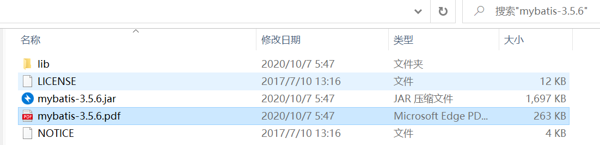

# 下载Mybatis工程包

打开链接 [https://github.com/mybatis/mybatis-3/releases ](https://github.com/mybatis/mybatis-3/releases下载) 下载MyBatis 所需要的包和源码，当前最新版本为 3.5.6，官方还提供了文档。

下载好 MyBatis 的包解压后，可以得到以下的文件目录：3.5.6为例。

mybatis-3.5.6.jar就是我们mybatis的库文件，是不是比较小，还没到1M。

