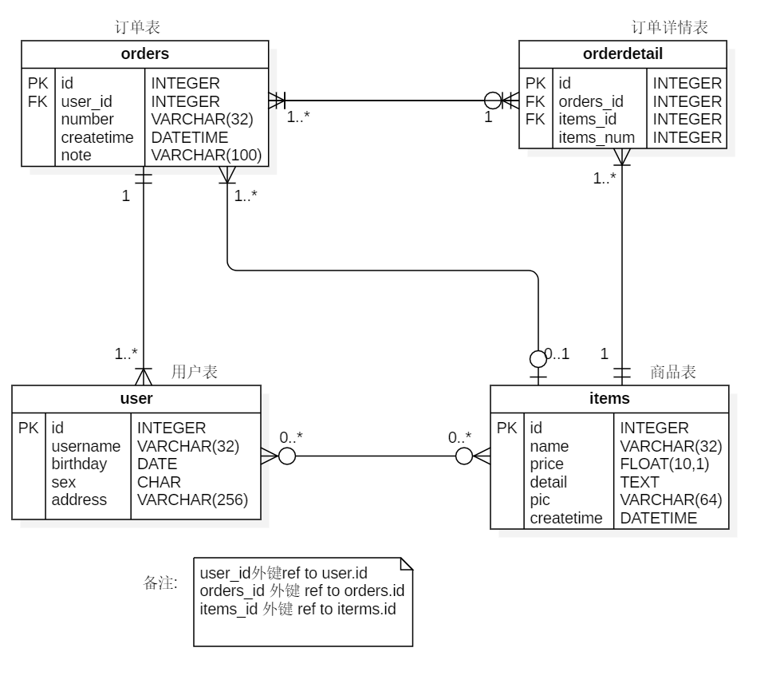

# 表关系说明

Mybatis作为一个ORM框架，也对sql的高级查询做了支持，下面学习mybatis中的一对一、一对多、多对多的查询。



### 说明

此案例的业务关系是用户、订单、订单详情、商品之间的关系，

* 一个订单只属于一个人。
* 一个订单可以有多个订单详情。
* 一个订单详情包含一个商品信息。

他们的关系是：

* 订单和人是 一对一的关系。
* 订单和详单是 一对多的关系。
* 订单和商品是 多对多关系。

利用StarUML构建E-R图，通过插件直接生成DDL

```text
SET FOREIGN_KEY_CHECKS = 0;
DROP TABLE IF EXISTS `orders`;
DROP TABLE IF EXISTS `user`;
DROP TABLE IF EXISTS `orderdetail`;
DROP TABLE IF EXISTS `items`;
SET FOREIGN_KEY_CHECKS = 1;

CREATE TABLE `orders` (
	`id` INTEGER NOT NULL,
	`user_id` INTEGER NOT NULL,
	`number` VARCHAR(32) NOT NULL,
	`createtime` DATETIME NOT NULL,
	`note` VARCHAR(100) NOT NULL,
	PRIMARY KEY (`id`)
);

CREATE TABLE `user` (
	`id` INTEGER NOT NULL,
	`username` VARCHAR(32) NOT NULL,
	`birthday` DATE NOT NULL,
	`sex` CHAR NOT NULL,
	`address` VARCHAR(256) NOT NULL,
	PRIMARY KEY (`id`)
);

CREATE TABLE `orderdetail` (
	`id` INTEGER NOT NULL,
	`orders_id` INTEGER NOT NULL,
	`items_id` INTEGER NOT NULL,
	`items_num` INTEGER NOT NULL,
	PRIMARY KEY (`id`)
);

CREATE TABLE `items` (
	`id` INTEGER NOT NULL,
	`name` VARCHAR(32) NOT NULL,
	`price` FLOAT(10,1) NOT NULL,
	`detail` TEXT NOT NULL,
	`pic` VARCHAR(64) NOT NULL,
	`createtime` DATETIME NOT NULL,
	PRIMARY KEY (`id`)
);

ALTER TABLE `orders` ADD FOREIGN KEY (`user_id`) REFERENCES `user`(`id`);
ALTER TABLE `orderdetail` ADD FOREIGN KEY (`orders_id`) REFERENCES `orders`(`id`);
ALTER TABLE `orderdetail` ADD FOREIGN KEY (`items_id`) REFERENCES `items`(`id`);
```


