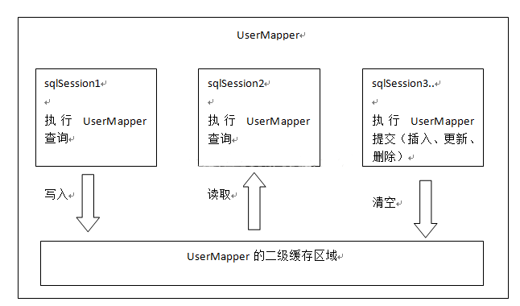

# 二级缓存



二级缓存是mapper级别的缓存，多个SqlSession去操作同一个Mapper的sql语句，多个SqlSession去操作数据库得到数据会存在二级缓存区域，**多个SqlSession可以共用二级缓存，二级缓存是跨SqlSession的。**

二级缓存是多个SqlSession共享的，其作用域是mapper的同一个namespace，不同的sqlSession两次执行相同namespace下的sql语句且向sql中传递参数也相同即最终执行相同的sql语句，第一次执行完毕会将数据库中查询的数据写到缓存（内存）（**注意：并且必须对第一个sqlSession关闭后，才把缓存存起来。**），第二次会从缓存中获取数据将不再从数据库查询，从而提高查询效率。Mybatis默认没有开启**二级缓存需要在setting全局参数中配置开启二级缓存。**

sqlSessionFactory层面上的二级缓存默认是不开启的，二级缓存的开启需要进行配置，实现二级缓存的时候，MyBatis要求返回的POJO必须是可序列化的。 也就是要求实现**Serializable接口**，配置方法很简单，只需要在映射XML文件配置就可以开启缓存了，如果我们配置了二级缓存就意味着：

* 映射语句文件中的所有select语句将会被缓存。 
* 映射语句文件中的所欲insert、update和delete语句会刷新缓存。
*  缓存会使用默认的Least Recently Used（LRU，最近最少使用的）算法来收回。 
* 根据时间表，比如No Flush Interval,（CNFI没有刷新间隔），缓存不会以任何时间顺序来刷新。
*  缓存会存储列表集合或对象\(无论查询方法返回什么\)的1024个引用 。
* 缓存会被视为是read/write\(可读/可写\)的缓存，意味着对象检索不是共享的，而且可以安全的被调用者修改，不干扰其他调用者或线程所做的潜在修改。 

开启二级缓存：在mapper标签中  加入&lt;cache/&gt;

```text
<mapper namespace="com.zhoujk.dao.UserMapper">
    <!--开启二级缓存-->
    <!--<cache/>-->
    <!--这个更高级的配置创建了一个FIFO缓存，并每隔60秒刷新缓存，储存结
      果对象或列表的512个引用，而且返回的对象被认为是只读的，
      因此在不同线程中的调用者之间修改他们会导致冲突。
   -->
    <cache eviction="FIFO" flushInterval="60000" size="512" readOnly="true"/>
```

关闭二级缓存：可直接去除&lt;cache&gt;，也可在mybatis-config.xml的settings修改配置

```text
    <settings>
        <!--开启驼峰匹配-->
        <setting name="mapUnderscoreToCamelCase" value="true"/>
         <!--开启二级缓存 全局总开关  如果这里关闭，mapper中设置开启也没有用-->
        <setting name="cacheEnabled" value="flase"/>
    </settings>
```

可用的收回策略有：

•	【默认】LRU——最近最少使用的：移除最长时间不被使用的对象 

•	 FIFO——先进先出的：按对象进入缓存的顺序来移除他们 

•	 SOFT——软引用：移除基于垃圾回收器状态和软引用规则的对象 

•	 WEAK——弱引用：更积极地移除基于垃圾收集器状态和弱引用规则的对象。

flushInterval（刷新间隔）可以被设置为任意的正整数（60\*60\*1000这种形式是不允许的），而且它们代表一个合理的毫秒形式的时间段。默认情况是不设置，也就是没有刷新间隔，缓存仅仅调用语句时刷新。 

size（引用数目）可以被设置为任意正整数，要记住你缓存的对象数目和你运行环境的可用内存资源数目。默认值是1024. 

readOnly（只读）属性可以被设置为true或false。只读的缓存会给所有调用者返回缓存对象的相同实例，因此这些对象不能被修改，这提供了很重要的性能优势。可读写的缓存会返回缓存对象的拷贝（通过发序列化）。这会慢一些，但是安全，因此默认是false。


配置完&lt;cache/&gt;表示该mapper映射文件中，所有的select语句都将被缓存，所有的insert、update和delete语句都将刷新缓存。但是实际中，我们并是希望这样，有些select不想被缓存时，可以添加select的属性useCache=“false”；有些insert、update和delete不想让他刷新缓存时，添加属性flushCache=”false ”。


