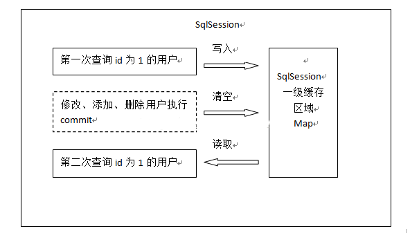

# 一级缓存

### 一级缓存（本地缓存）

Mybatis 使用到了两种缓存：**本地缓存**（local cache）和**二级缓存**（second level cache）。



每当一个新 session 被创建，MyBatis 就会创建一个与之相关联的本地缓存。任何在 session 执行过的查询结果都会被保存在本地缓存中，所以，当再次执行参数相同的相同查询时，就不需要实际查询数据库了。**本地缓存将会在做出修改、事务提交或回滚，以及关闭 session 时清空**。

```text
//对于你打开的任何 session，你都要保证它们被妥善关闭，这很重要。保证妥善关闭的最佳代码模式是这样的：

SqlSession session = sqlSessionFactory.openSession();
try (SqlSession session = sqlSessionFactory.openSession()) {
    // 假设下面三行代码是你的业务逻辑
    session.insert(...);
    session.update(...);
    session.delete(...);
    // session.rollback(...);
    session.commit();
}
  //使用sqlSession.clearCache();可以强制清除缓存。
```

默认情况下，**本地缓存数据的生命周期等同于整个 session 的周期**。由于缓存会被用来解决循环引用问题和加快重复嵌套查询的速度，所以无法将其完全禁用。但是你可以通过设置 localCacheScope=STATEMENT 来只在语句执行时使用缓存。

注意，如果 localCacheScope 被设置为 SESSION，对于某个对象，MyBatis 将返回在本地缓存中唯一对象的引用。对返回的对象（例如 list）做出的任何修改将会影响本地缓存的内容，进而将会影响到在本次 session 中从缓存返回的值。因此，不要对 MyBatis 所返回的对象作出更改，以防后患。

简单来说,Mybatis的一级缓存的作用域是session，当openSession\(\)后，如果执行相同的SQL（相同语句和参数），**Mybatis不进行执行SQL，而是从缓存中命中返回。**

原理:Mybatis执行查询时首先去缓存区命中，如果命中直接返回，没有命中则执行sQL，从数据库中查询。

在mybatis中，一级缓存默认是开启的，并且一直无法关闭 

使用—级缓存需满足的条件: 

1. 同一个session中
2. 相同的SQL和参数


