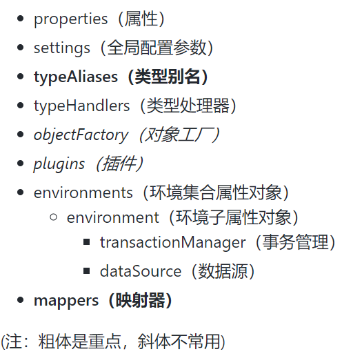

# mybatis-config.xml配置文件

## 介绍

在 WEB 工程中，对于 MyBatis 最核心的全局配置文件是 SqlMapConfig.xml 文件，其中包含了数据库的连接配置信息、Mapper 映射文件的加载路径、全局参数、类型别名等。

* configuration：包裹所有配置标签，是整个配置文件的顶级标签。
* properties：属性，该标签可以引入外部配置的属性，也可以自己配置。该配置标签所在的同一个配置文件中的其他配置均可引用此配置中的属性。
* setting：全局配置参数，用来配置一些改变运行时行为的信息，例如是否使用缓存机制，是否使用延迟加载，是否使用错误处理机制等。并且可以设置最大并发请求数量、最大并发事务数量，以及是否启用命令空间等。
* typeAliases：类型别名，用来设置一些别名来代替 Java 的长类型声明，如 java.lang.int 变为 int，减少配置编码的冗余。
* typeHandlers：类型处理器，将 sql 中返回的数据库类型转换为相应 Java 类型的处理器配置。
* objectFactory：对象工厂，实例化目标类的工厂类配置。
* plugins：插件，可以通过插件修改 MyBatis 的核心行为，例如对语句执行的某一点进行拦截调用。
* environments：环境集合属性对象，数据库环境信息的集合。在一个配置文件中，可以有多种数据库环境集合，这样使 MyBatis 将 sql 同时映射至多个数据库。
* environment：环境子属性对象，数据库环境配置的详细配置。
* transactionManager：事务管理，指定 MyBatis 的事务管理器。
* dataSource：数据源，使其中的 type 指定数据源的连接类型，在标签对中可以使用 property 属性指定数据库连接池的其他信息。
* mappers：映射器，配置 sql 映射文件的位置，告知 MyBatis 去哪里加载 sql 映射配置。

MyBatis 配置包含对 MyBatis 的行为方式有显着影响的设置（settings）和属性（properties）。文档的顶层结构如下：



## 基本配置案例

```text
<?xml version="1.0" encoding="UTF8"?>
<!DOCTYPE configuration PUBLIC
        "-//mybatis.org//DTD Config 3.0//EN"
        "http://mybatis.org/dtd/mybatis-3-config.dtd">
<!--configuration核心配置文件-->
<configuration>
    <!--加载类路径下的属性文件-->
    <properties resource="db.properties"/>
    <!-- 设置一个默认的连接环境信息-->
    <environments default="Mysql8.0_development">
        <!-- 连接环境信息  取一个任意的唯一名字-->
        <environment id="Mysql8.0_development">
            <!-- mybatis使用jdbc事务管理方式 -->
            <transactionManager type="JDBC"/>
            <!--mybatis使用连接池的方式来获取连接-->
            <dataSource type="POOLED">
                <!--配置与数据库交互的4必要属性-->
                <property name="driver" value="${mysql.driver}"/>
                <property name="url"  value="${mysql.url}"/>
                <property name="username" value="${mysql.username}"/>
                <property name="password" value="${mysql.password}"/>
            </dataSource>
        </environment>

        <!-- 再配置一个(可配置多个)连接环境信息  取一个任意的唯一名字-->
        <environment id="Oracle_development">
            <!-- mybatis使用jdbc事务管理方式 -->
            <transactionManager type="JDBC"/>
            <!--mybatis使用连接池的方式来获取连接-->
            <dataSource type="POOLED">
                <!--配置与数据库交互的4必要属性-->
                <property name="driver" value="${oracle.driver}"/>
                <property name="url"  value="${oracle.url}"/>
                <property name="username" value="${oracle.username}"/>
                <property name="password" value="${oracle.password}"/>
            </dataSource>
        </environment>
    </environments>
    <!--每一个Mapper.xml都需要在Mybatis的核心配置文件中注册-->
    <mappers>
        <mapper resource="Mapper/UserMapper.xml"/>
    </mappers>
</configuration>
```

### properties\(属性\)

将数据库连接参数单独配置在db.properties中，只需要在SqlMapConfig.xml中加载db.properties的属性值。在SqlMapConfig.xml中就不需要对数据库连接参数硬编码。

将数据库连接参数只配置在db.properties中。原因：方便对参数进行统一管理，其它xml可以引用该db.properties。

```text
jdbc.driver=com.mysql.jdbc.Driver
jdbc.url=jdbc:mysql://120.25.162.238:3306/mybatis001?characterEncoding=utf-8
jdbc.username=root
jdbc.password=123
```

在sqlMapConfig.xml加载属性文件：

```text
<properties resource="db.properties">
        <!--properties中还可以配置一些属性名和属性值  -->
        <!-- <property name="jdbc.driver" value=""/> -->
</properties>

<!-- 和spring整合后 environments配置将废除-->
<environments default="development">
    <environment id="development">
        <!-- 使用jdbc事务管理，事务控制由mybatis-->
        <transactionManager type="JDBC" />
        <!-- 数据库连接池,由mybatis管理-->
        <dataSource type="POOLED">
            <property name="driver" value="${jdbc.driver}" />
            <property name="url" value="${jdbc.url}" />
            <property name="username" value="${jdbc.username}" />
            <property name="password" value="${jdbc.password}" />
        </dataSource>
    </environment>
</environments>
```

注意： MyBatis 将按照下面的顺序\(优先级\)来加载属性：

* 在`properties`元素体内定义的属性首先被读取。
* 然后会读取`properties`元素中resource或url加载的属性，它会覆盖已读取的同名属性。
* 最后读取`parameterType`传递的属性，它会覆盖已读取的同名属性。

建议：

* 不要在`properties`元素体内添加任何属性值，只将属性值定义在properties文件中。
* 在properties文件中定义属性名要有一定的特殊性，如：XXXXX.XXXXX.XXXX

### settings\(全局参数配置\)

mybatis框架在运行时可以调整一些运行参数,比如：开启二级缓存、开启延迟加载...

全局参数将会影响mybatis的运行行为。具体参考官网：

> [mybatis-settings](http://www.mybatis.org/mybatis-3/configuration.html#settings)

### typeAliases\(类型别名\)

在mapper.xml中，定义很多的statement，statement需要`parameterType`指定输入参数的类型、需要`resultType`指定输出结果的映射类型。

如果在指定类型时输入类型全路径，不方便进行开发，可以针对`parameterType`或`resultType`指定的类型定义一些别名，在mapper.xml中通过别名定义，方便开发。

* mybatis默认支持别名

> 参考 [typeAliases](http://www.mybatis.org/mybatis-3/configuration.html#typeAliases)

| 别名 | 映射的类型 |
| :--- | :--- |
| \_byte | byte |
| \_long | long |
| \_short | short |
| \_int | int |
| \_integer | int |
| \_double | double |
| \_float | float |
| \_boolean | boolean |
| string | String |
| byte | Byte |
| long | Long |
| short | Short |
| int | Integer |
| integer | Integer |
| double | Double |
| float | Float |
| boolean | Boolean |
| date | Date |
| decimal | BigDecimal |
| bigdecimal | BigDecimal |

* 自定义别名
  * 单个别名定义
  * 批量定义别名（常用）

```text
<!-- 别名定义 -->
<typeAliases>

    <!-- 针对单个别名定义
    type：类型的路径
    alias：别名
     -->
    <!-- <typeAlias type="cn.itcast.mybatis.po.User" alias="user"/> -->
    <!-- 批量别名定义
    指定包名，mybatis自动扫描包中的po类，自动定义别名，别名就是类名（首字母大写或小写都可以）
    -->
    <package name="com.iot.mybatis.po"/>

</typeAliases>
```

### typeHandlers\(类型处理器\)

mybatis中通过typeHandlers完成jdbc类型和java类型的转换。例如：

```text
<select id="findUserById" parameterType="int" resultType="user">
		select * from user where id = #{id}
</select>
```

mybatis自带的类型处理器基本上满足日常需求，不需要单独定义。

mybatis支持类型处理器

> 参考 [typeHandlers](http://www.mybatis.org/mybatis-3/configuration.html#typeHandlers)

| 类型处理器 | Java类型 | JDBC类型 |
| :--- | :--- | :--- |
| BooleanTypeHandler | Boolean，boolean | 任何兼容的布尔值 |
| ByteTypeHandler | Byte，byte | 任何兼容的数字或字节类型 |
| ShortTypeHandler | Short，short | 任何兼容的数字或短整型 |
| IntegerTypeHandler | Integer，int | 任何兼容的数字和整型 |
| LongTypeHandler | Long，long | 任何兼容的数字或长整型 |
| FloatTypeHandler | Float，float | 任何兼容的数字或单精度浮点型 |
| DoubleTypeHandler | Double，double | 任何兼容的数字或双精度浮点型 |
| BigDecimalTypeHandler | BigDecimal | 任何兼容的数字或十进制小数类型 |
| StringTypeHandler | String | CHAR和VARCHAR类型 |
| ClobTypeHandler | String | CLOB和LONGVARCHAR类型 |
| NStringTypeHandler | String | NVARCHAR和NCHAR类型 |
| NClobTypeHandler | String | NCLOB类型 |
| ByteArrayTypeHandler | byte\[\] | 任何兼容的字节流类型 |
| BlobTypeHandler | byte\[\] | BLOB和LONGVARBINARY类型 |
| DateTypeHandler | Date（java.util） | TIMESTAMP类型 |
| DateOnlyTypeHandler | Date（java.util） | DATE类型 |
| TimeOnlyTypeHandler | Date（java.util） | TIME类型 |
| SqlTimestampTypeHandler | Timestamp（java.sql） | TIMESTAMP类型 |
| SqlDateTypeHandler | Date（java.sql） | DATE类型 |
| SqlTimeTypeHandler | Time（java.sql） | TIME类型 |
| ObjectTypeHandler | 任意 | 其他或未指定类型 |
| EnumTypeHandler | Enumeration类型 | VARCHAR-任何兼容的字符串类型，作为代码存储（而不是索引） |

### mappers\(映射配置\)

* 通过resource加载单个映射文件

```text
<!--通过resource方法一次加载一个映射文件 -->
<mapper resource="mapper/UserMapper.xml"/>
```

* 通过mapper接口加载单个mapper

```text
 <!-- 通过mapper接口加载单个 映射文件
        遵循一些规范：需要将mapper接口类名和mapper.xml映射文件名称保持一致，且在一个目录中
        上边规范的前提是：使用的是mapper代理方法
         -->
<mapper class="com.iot.mybatis.mapper.UserMapper"/> 
```

目录示例

```text
com.iot.mybatis.mapper------------------package包
           |----UserMapper.java
           |----UserMapper.xml
              
```

* 批量加载mapper\(推荐使用\)

```text
<!-- 批量加载mapper
		指定mapper接口的包名，mybatis自动扫描包下边所有mapper接口进行加载
		遵循一些规范：需要将mapper接口类名和mapper.xml映射文件名称保持一致，且在一个目录 中
		上边规范的前提是：使用的是mapper代理方法
		 -->
<package name="com.iot.mybatis.mapper"/>
```

